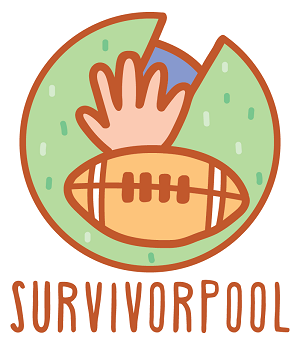

## Installation & Running Locally

* Create an .env file in the root of the project named: `env.development.local` for local development.

* `yarn install` or `npm install`

* Start the client locally - `yarm start` or `npm run start`

* Your browser will open to _localhost:8000_

## Tests

`yarn test` or `npm run test`

Create tests alongside components in the format of `(component).test.js`